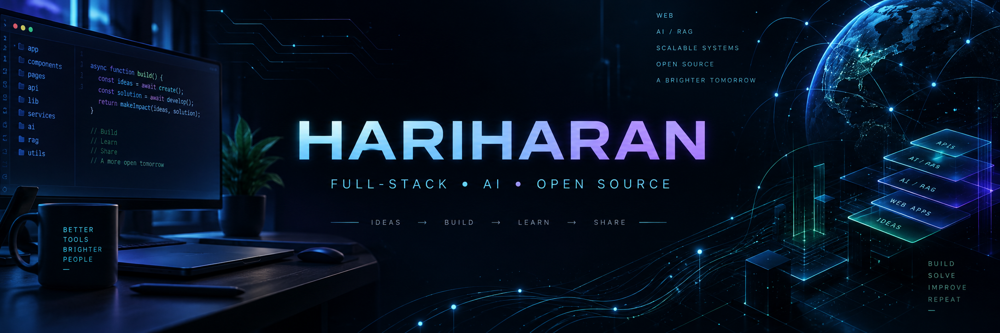

<div align="center">



<br />

<a href="https://git.io/typing-svg">
  
</a>

<p>
  <a href="https://github.com/Dev-hari1433?tab=followers"></a>
  <a href="https://github.com/Dev-hari1433?tab=repositories"></a>
  
</p>

<p>
  <a href="mailto:hhari64099@gmail.com"></a>
  <a href="https://www.linkedin.com/in/hari-haran-0406802a8/"></a>
  <a href="https://github.com/Dev-hari1433"></a>
</p>

</div>

## About me

```ts
const hariharan = {
  location: "Chennai, India",
  role: "Software Developer",
  focus: ["Full-stack web", "AI / RAG", "Accessible products"],
  languages: ["TypeScript", "JavaScript", "Python"],
  principle: "Build useful things, learn deeply, and share the result.",
};
```

I build practical, user-focused software across modern web development and applied AI. My public work ranges from accessibility accountability and legal knowledge tools to voice-enabled RAG, learning analytics, event platforms, and dashboards.

- Building end-to-end products with React, Next.js, TypeScript, Python, and Supabase
- Interested in retrieval-augmented generation, voice interfaces, responsible AI, and developer tooling
- Care about accessibility, clear architecture, human-in-the-loop systems, and polished product UX
- Learning in public through projects, experiments, and steady iteration

## Technology toolkit

<div align="center">

### Languages


### Frontend


### Backend, data and APIs


### Tools and delivery


</div>

## Selected work

<table>
  <tr>
    <td width="50%" valign="top">
      <h3 align="center">AccessTrack</h3>
      <p align="center"><strong>Accessibility audit → verified action</strong></p>
      <p>Four-role accountability platform with citizen reporting, evidence workflows, AI-assisted photo screening, human verification, public scorecards, and escalation tracking.</p>
      <p><code>Next.js</code> <code>TypeScript</code> <code>Supabase</code> <code>AI</code></p>
      <p align="center"><a href="https://github.com/Dev-hari1433/Audit-to-action"><strong>View repository →</strong></a></p>
    </td>
    <td width="50%" valign="top">
      <h3 align="center">Legal Vault</h3>
      <p align="center"><strong>Modern legal knowledge experience</strong></p>
      <p>A TypeScript project exploring structured legal information, searchable experiences, and a clean user interface for navigating complex content.</p>
      <p><code>TypeScript</code> <code>Web App</code> <code>Vercel</code></p>
      <p align="center"><a href="https://github.com/Dev-hari1433/legal-vault"><strong>Source</strong></a> · <a href="https://legal-vault-coral.vercel.app"><strong>Live demo</strong></a></p>
    </td>
  </tr>
  <tr>
    <td width="50%" valign="top">
      <h3 align="center">RAG Voice</h3>
      <p align="center"><strong>Voice meets retrieval-augmented AI</strong></p>
      <p>A Python project focused on connecting conversational voice interactions with retrieval-based context and grounded AI responses.</p>
      <p><code>Python</code> <code>RAG</code> <code>Voice AI</code></p>
      <p align="center"><a href="https://github.com/Dev-hari1433/RAG-VOICE"><strong>View repository →</strong></a></p>
    </td>
    <td width="50%" valign="top">
      <h3 align="center">Quiz & Learning Analytics</h3>
      <p align="center"><strong>Assessment and insight dashboard</strong></p>
      <p>A TypeScript learning product combining quizzes with analytics to turn assessment activity into understandable progress signals.</p>
      <p><code>TypeScript</code> <code>Analytics</code> <code>Education</code></p>
      <p align="center"><a href="https://github.com/Dev-hari1433/Quiz-and-Learning-Analytics"><strong>Source</strong></a> · <a href="https://quiz-and-learning-analytics.vercel.app"><strong>Live demo</strong></a></p>
    </td>
  </tr>
  <tr>
    <td width="50%" valign="top">
      <h3 align="center">TechNeuro Codefest '26</h3>
      <p align="center"><strong>College symposium portal</strong></p>
      <p>A responsive landing page and registration experience for TechNeuro Codefest 2026.</p>
      <p><code>JavaScript</code> <code>Responsive UI</code> <code>Vercel</code></p>
      <p align="center"><a href="https://github.com/Dev-hari1433/techneuro-codefest-26"><strong>Source</strong></a> · <a href="https://techneuro-codefest-26.vercel.app"><strong>Live demo</strong></a></p>
    </td>
    <td width="50%" valign="top">
      <h3 align="center">Expense Analytics</h3>
      <p align="center"><strong>Daily finance dashboard</strong></p>
      <p>A React-based daily expense analytics dashboard with visual summaries and a clean, approachable interface.</p>
      <p><code>React</code> <code>JavaScript</code> <code>Dashboard</code></p>
      <p align="center"><a href="https://github.com/Dev-hari1433/Naan-Mudhalvan-React-project"><strong>Source</strong></a> · <a href="https://dev-hari1433.github.io/Naan-Mudhalvan-React-project/"><strong>Live demo</strong></a></p>
    </td>
  </tr>
</table>

## GitHub at a glance

<div align="center">


<br />


<br />


</div>

> GitHub language cards measure bytes in public repositories—not overall skill level.

## Engineering principles

```text
01. Start with the user and the real problem.
02. Prefer clear systems over clever code.
03. Keep AI assistive, explainable, and human-supervised.
04. Treat accessibility, privacy, and reliability as product features.
05. Ship, measure, learn, and improve.
```

## Currently exploring

<p>
  
  
  
  
</p>

## Contribution journey

<div align="center">


</div>

## Let's connect

I’m always interested in thoughtful software, AI experiments, hackathons, and collaborative learning. If a project here sparks an idea, open an issue or reach out.

<div align="center">

<a href="mailto:hhari64099@gmail.com"></a>
<a href="https://www.linkedin.com/in/hari-haran-0406802a8/"></a>

<br /><br />

<em>“Better tools. Brighter people. A more open tomorrow.”</em>

<br />

<sub>Designed and maintained by <a href="https://github.com/Dev-hari1433">Hariharan</a>.</sub>

</div>
